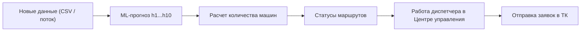

# RWB Flow — платформа прогнозирования отгрузок и диспетчеризации транспорта

RWB Flow — это система, которая переводит ML-прогноз в операционное действие диспетчера: сколько машин нужно вызвать, какие маршруты можно обрабатывать автоматически, а какие отправить на ручную проверку.


https://github.com/user-attachments/assets/de290467-91c0-4823-ac83-770874fbea6b


[1) Инструкция запуска](#run-guide)  
[2) Артефакты трех ML-моделей](#ml-artifacts)  
[3) ML-часть решения](#ml-solution)  
[4) Устройство сайта и продуктовое решение](#product-solution)

---

## Содержание
- [1. Бизнес-решение](#business-solution)
- [2. Продуктовое решение: как сайт помогает бизнесу](#product-solution)
- [3. Центр управления: почему реализован именно так](#control-center)
- [4. Аналитика: какой график какую ценность дает оператору](#analytics)
- [5. ML-решение](#ml-solution)
- [6. Оценка качества и baseline-сравнение](#evaluation)
- [7. Пути развития и масштабирования](#scaling)
- [8. Артефакты трех ML-моделей](#ml-artifacts)
- [9. Техническое приложение (API)](#api-appendix)
- [10. Инструкция запуска](#run-guide)

---

<a id="business-solution"></a>
## 1. Бизнес-решение

### 1.1 Проблема
В логистике ошибка планирования быстро становится прямой потерей:
- недовызов транспорта -> срыв отгрузки и простой склада;
- перевызов транспорта -> лишняя стоимость рейсов;
- слишком много «спорных» маршрутов -> перегруз диспетчера и замедление процесса.

### 1.2 Цель
Сделать стабильный переход:

**прогноз отгрузок -> расчет машин -> приоритизация маршрутов -> отправка заявок в ТК**.

### 1.3 Что получает бизнес
- снижение ручной нагрузки за счет контролируемого автопринятия;
- прозрачное управление рисками (где перегруз, где аномальное падение);
- единый контур принятия решений без разрыва между ML и диспетчеризацией.

---

<a id="product-solution"></a>
## 2. Продуктовое решение: как сайт помогает бизнесу

### 2.1 Где сайт дает прямую бизнес-ценность

| Ситуация | Что видит оператор в системе | Какое решение принимает | Бизнес-эффект |
|---|---|---|---|
| Резкий рост маршрутов перед пиком | «Критическая нагрузка» + расчет нужных машин | Быстро увеличивает объем заявок на проблемных маршрутах | Снижение риска нехватки транспорта |
| Массовое падение части маршрутов | «Аномальное снижение» + фильтр по статусу | Уменьшает/перенаправляет заявки, избегает перевызова | Снижение лишних транспортных затрат |
| Большой поток маршрутов в смене | Доля авто-решений и список «На проверке» | Фокусируется только на действительно спорных строках | Экономия времени диспетчера и ускорение цикла |


### 2.2 Ключевое: сайт работает в режиме инференса на новых данных
Система уже готова к боевой работе с новыми входами:
1. Оператор загружает новый CSV.
2. Запускает обработку.
3. Модель пересчитывает прогнозы на новых данных.
4. Центр управления и аналитика автоматически показывают обновленный результат.

Это значит:
- решение **не привязано к тестовому набору**;
- решение **не работает только «на заранее известных ответах»**;
- решение готово к регулярной эксплуатации на новых данных.


### 2.3 Сквозная логика продукта


### 2.4 Режим планирования
- расчет идет каждые 30 минут;
- прогноз строится на горизонтах `h1...h10`;
- интерфейс ориентирован на ближайшие и следующие 2 часа (операционный ритм смены).

---

<a id="control-center"></a>
## 3. Центр управления: почему реализован именно так

Мы сделали Центр управления «status-first», потому что диспетчеру важно быстро принять решение, а не анализировать технические детали модели.

### 3.1 Почему именно такая структура экрана
- верхние KPI: сразу оценка масштаба проблемы;
- фильтры статусов: мгновенный переход к приоритетным маршрутам;
- таблица с расчетом машин: решение по каждой строке без переключения экранов;
- пакетные действия: быстрое выполнение массовых операций.

### 3.2 Что каждый блок дает оператору

| Блок | Что показывает | Как помогает принять решение |
|---|---|---|
| Потребность в транспорте | Общий объем машин на волну | Понимание масштаба вызова в смене |
| Проблемные объекты | Число маршрутов с риском | Оценка нагрузки на ручную работу |
| Статус диспетчеризации | Сколько уже отправлено / в ожидании | Контроль исполнения, не только плана |
| Таблица маршрутов | Прогноз, trust, статус, машины | Конкретные действия по каждой строке |


---

<a id="analytics"></a>
## 4. Аналитика: какой график какую ценность дает оператору

### 4.1 Quality-блок: официальный score и сравнение с baseline
Что видит оператор:
- `ML`, `Strong baseline`, `Primitive baseline`;
- дельту качества;
- график score по `h1...h10`.

Практическая ценность:
- честный ответ: «наша модель действительно лучше ориентиров или нет»;
- понимание, на каких горизонтах доверие выше.

### 4.2 Как считаем trust и как он влияет на статусы
Trust — это policy-score надежности маршрута (0–100), который помогает решать, где можно автопринятие, а где нужен диспетчер.

Базовая формула:

`trust = 100 * (w1*s_horizon + w2*s_stability + w3*s_agreement + w4*s_route_err + w5*s_office_err + w6*s_history + w7*s_freshness)`

Где сигналы `s_*` нормированы в диапазон `[0..1]`.

Текущие веса (из рабочего stage3-артефакта):
- горизонт: `0.20`
- стабильность маршрута: `0.16`
- согласие с strong baseline: `0.18`
- история ошибок маршрута: `0.18`
- история ошибок офиса: `0.14`
- полнота истории: `0.08`
- свежесть данных: `0.06`

Важно:
- официальный KPI при этом остается `WAPE + |Relative Bias|`;
- agreement-компонента в текущем режиме переведена в `neutral` (фиксированная 0.5 по итогам ablation), то есть не «перетягивает» trust;
- policy calibration сейчас `none`, без искусственного растягивания.

Как trust применяется в статусах:
- высокий trust -> чаще авто-решение;
- низкий trust + существенная дельта к baseline -> ручная проверка или риск-статус.

### 4.3 Распределение маршрутов по режимам работы
Что видит оператор:
- доли `В норме / Требует проверки / Аномальное снижение / Критическая нагрузка`.

Практическая ценность:
- понимание, сколько работы идет в автомате и сколько требует ручного контроля.

### 4.4 Надежность автопринятия решения
Что видит оператор:
- `P10`, `P50`, `P90` trust;
- долю маршрутов выше порогов;
- распределение trust;
- факторы, влияющие на trust.

Практическая ценность:
- понятный диапазон надежности, чтобы не принимать «слепые» авто-решения.

### 4.5 Где наш прогноз надежнее ориентира (office × horizon)
Что видит оператор:
- heatmap «Чаще точнее»;
- heatmap «Риск ошибки».

Практическая ценность:
- где можно усиливать автоматизацию;
- где нужно оставлять больший ручной контроль.

### 4.6 Стабильность данных и скорость расчета
Что видит оператор:
- freshness данных;
- latency инференса;
- контекст пересчета.

Практическая ценность:
- уверенность, что решения принимаются на актуальных данных и вовремя.


---

<a id="ml-solution"></a>
## 5. ML-решение

### 5.1 Что представляет собой решение
- 10 горизонтов: `h1...h10`;
- один алгоритм: `LightGBM`;
- `CPU-only`;
- без ансамблей нескольких алгоритмов.

Почему это важно бизнесу:
- ниже нагрузка на инфраструктуру;
- быстрее пересчет;
- проще сопровождение и выше предсказуемость работы.

### 5.2 Архитектура модели
- historical features
- status features
- base forecast
- residual LightGBM
- calibration
- final prediction


### 5.3 Почему базой выбрали `blend_roll48_same7d`
Мы сравнивали набор баз:
- `target_2h`
- `roll48`
- `same7d`
- `lag48`
- `lag336`
- `mean_lag48_lag336`
- `blend_roll48_same7d`
- `blend_all4`

Финально выбрали `blend_roll48_same7d`, потому что она дала лучший и более стабильный результат.

Логика:
- `roll48` ловит свежую локальную динамику;
- `same7d` учитывает повторяемость временного слота;
- их комбинация устойчивее одиночных баз.

`blend_roll48_same7d = 0.5 * target_roll_mean_48 + 0.5 * same_slot_mean_7d`

Финальный прогноз строится как:

`final = baseline + residual_model_prediction`

### 5.4 Какие признаки использует модель
Для каждой horizon-модели:
- 70 основных признаков;
- +3 horizon-specific (`future_hour_h`, `future_minute_h`, `future_dow_h`);
- итого 73 признака на горизонт.

Группы признаков:
- calendar;
- lag/rolling target;
- base features;
- status raw;
- semantic status features.


### 5.5 Как работает обучение по горизонтам
- отдельная модель на каждый горизонт;
- единая сильная база;
- residual learning;
- разные train windows:
  - `h1-h3`: 28 дней
  - `h4-h7`: 42 дня
  - `h8-h10`: 56 дней

Так получилось точнее и быстрее, чем единое окно для всех горизонтов.

### 5.6 Как валидировали (и почему это не «под тест»)
- temporal split;
- без random CV;
- проверка по последовательным периодам;
- отдельная калибровочная неделя до финального участка.

Принципиально:
- мы **не подгоняли** модель под конкретный тестовый шаблон;
- модель оценивалась как эксплуатационное решение, которое должно работать на новых данных.

---

<a id="evaluation"></a>
## 6. Оценка качества и baseline-сравнение

### 6.1 Официальная метрика
`Score = WAPE + |Relative Bias|`

- `WAPE = sum(abs(y - y_hat)) / sum(y)`
- `Relative Bias = abs(sum(y_hat)/sum(y) - 1)`

### 6.2 Сравниваем три варианта
- `ML`
- `Strong baseline = blend_roll48_same7d`
- `Primitive baseline = same_4w`

Средние результаты по `h1...h10`:
- `ML`: `0.2484`
- `Strong baseline`: `0.3026`
- `Primitive baseline`: `0.3984`

### 6.3 Бизнес-метрики системы
- доля авто-решений;
- доля маршрутов на ручной проверке;
- доля критических/аномальных статусов;
- freshness;
- latency (`p50/p95`).

Почему это важно:
- эти метрики показывают реальную операционную пользу, а не только offline-score.

---

<a id="scaling"></a>
## 7. Пути развития и масштабирования

### 7.1 Масштабирование
- вынести инференс в отдельный воркер;
- пересчет аналитических артефактов перевести в background jobs;
- добавить версионирование моделей и снапшотов прогнозов;
- разделить online serving и offline-пересборку.

### 7.2 Какие данные стоит добавить
- типы ТС и реальная вместимость;
- SLA и фактическое время подачи по перевозчикам;
- погодные и дорожные факторы;
- календарь промо/событий;
- ограничения склада по слотам.

### 7.3 Ожидаемый эффект
- точнее расчет транспорта;
- меньше ручных проверок;
- меньше потерь от недогруза/перегруза;
- устойчивее качество в пиковые периоды.

---

<a id="ml-artifacts"></a>
## 8. Артефакты трех ML-моделей

Раздел зарезервирован под финальные ссылки.

| Модель | Назначение | Ссылка |
|---|---|---|
| Model A (финальная) | Основной production-прогноз | (https://disk.yandex.ru/d/m9nA1JWaGQqgVw) |
| Model B | Альтернативная модель | (https://disk.yandex.ru/d/sKRDH5wKB8fL7g) |
| Model C | Альтернативная модель | (https://disk.yandex.ru/d/W25NTat1aFDaIA) |

Текущие рабочие артефакты находятся в папке `model/`.

---

<a id="api-appendix"></a>
## 9. Техническое приложение (API)

Этот раздел вынесен в конец, так как ключевая часть решения — бизнес-логика и операционная ценность интерфейса.

| Endpoint | Метод | Назначение |
|---|---|---|
| `/api/dispatch-registry` | `GET` | Реестр маршрутов, статусы, расчет транспорта |
| `/api/ml-insights` | `GET` | Данные для аналитических блоков |
| `/api/dashboard-metrics` | `GET` | KPI верхнего уровня |
| `/api/demo/upload-csv` | `POST` | Stage raw CSV |
| `/api/demo/process-upload` | `POST` | Инференс и применение нового прогноза |
| `/api/demo/changes` | `GET` | Дельта изменений после инференса |
| `/api/demo/reset` | `POST` | Возврат к исходному прогнозу |

---

<a id="run-guide"></a>
## 10. Инструкция запуска

Инструкция рассчитана на запуск на любом ПК без привязки к локальным путям.

### 10.1 Установите инструменты
1. `Git`
2. `Node.js 20+`
3. `Python 3.10+`

Проверка:
```bash
node -v
npm -v
python --version
```

### 10.2 Клонируйте проект
```bash
git clone https://github.com/Yujir0k/Repository18983.git
cd Repository18983
```

### 10.3 Установите зависимости
```bash
npm install
```

### 10.4 Настройте Python-окружение
Windows (PowerShell):
```powershell
python -m venv .venv
.\.venv\Scripts\Activate.ps1
python -m pip install --upgrade pip
pip install numpy pandas lightgbm pyarrow
```

macOS/Linux:
```bash
python3 -m venv .venv
source .venv/bin/activate
python -m pip install --upgrade pip
pip install numpy pandas lightgbm pyarrow
```

### 10.5 Запустите сайт
```bash
npm run dev -- --port 3000
```

Откройте:
- `http://localhost:3000/dashboard`
- `http://localhost:3000/analytics`

### 10.6 Проверка режима инференса на новых данных
1. В интерфейсе загрузите CSV.
2. Нажмите обработку новых данных.
3. Убедитесь, что прогноз и статусы обновились.

Это подтверждает, что система работает на новых входах, а не только на фиксированном тестовом наборе.

### 10.7 Если модель хранится не в `model/`
Windows:
```powershell
$env:MODEL_DIR="C:\path\to\model"
npm run dev -- --port 3000
```

macOS/Linux:
```bash
export MODEL_DIR="/path/to/model"
npm run dev -- --port 3000
```

### 10.8 Типовые проблемы
- ошибка инференса -> проверьте `.venv` и пакеты `numpy/pandas/lightgbm/pyarrow`;
- порт занят -> используйте `--port 3001`;
- пустая аналитика -> проверьте stage-артефакты в `model/`.

---

